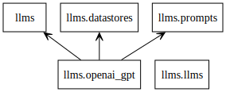
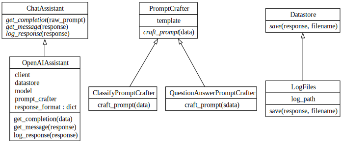

# 5D Take Home Technical Test

## How to run with docker?
1. Clone the repository and go to the root of it.
2. Set environment variable `OPENAI_SECRET_KEY` in your OS (Linux or macOS).
3. Using the dockerfile build the image with tag `flask3.12`:
    ```shell
    docker build -t flask3.12 .
    ```
4. Running the app: run the container while with:
    ```shell
    docker run -it -p 8000:8000 -e OPENAI_SECRET_KEY=$OPENAI_SECRET_KEY flask3.12 app.py
    ```
    You should see:
    ```
    * Serving Flask app 'app'
    * Debug mode: off
    ```
6. Run `python evaluate.py` in another terminal.
7. Running the tests:
    ```
    docker run -it -p 8000:8000 -e OPENAI_SECRET_KEY=$OPENAI_SECRET_KEY flask3.12 -m pytest .
    ```

# High-Level Design Overview
### Packages


### Classes


# Maintainability Index (radon) 
- Rank: A
- Maintainability: Very-high 

## Top-1 Run
Using `prompt3.txt`, JSON examples with Jinja2 templating.
```shell
python evaluate.py                                                                                                                                                                                                                              ⏎ ✹ ✭
[CORRECT] Expected ['V1', 'C1'], got ['V1', 'C1']
[CORRECT] Expected ['CO1'], got ['CO1']
[CORRECT] Expected ['RR1', 'CC1'], got ['RR1', 'CC1']
[CORRECT] Expected ['B1', 'M1'], got ['B1', 'M1']
[CORRECT] Expected ['MG1', 'G1'], got ['MG1', 'G1']
[CORRECT] Expected ['P1', 'C2'], got ['P1', 'C2']
[CORRECT] Expected ['H1', 'O1'], got ['H1', 'O1']
[CORRECT] Expected ['F1', 'S2'], got ['F1', 'S2']
[CORRECT] Expected ['A1', 'CH1'], got ['A1', 'CH1']
[CORRECT] Expected ['T1', 'PB1'], got ['T1', 'PB1']
[CORRECT] Expected ['SC1', 'L1'], got ['SC1', 'L1']
[CORRECT] Expected ['C3', 'BL1'], got ['C3', 'BL1']
[CORRECT] Expected [], got []
[CORRECT] Expected [], got []
[CORRECT] Expected [], got []
[CORRECT] Expected [], got []
[INCORRECT] Expected [], got ['C1']
[CORRECT] Expected [], got []
[CORRECT] Expected [], got []
[CORRECT] Expected [], got []
[CORRECT] Expected [], got []
[INCORRECT] Expected [], got ['C2']
data/case_1.json accuracy: 90.91%
[INCORRECT] Expected ['I1', 'R1'], got ['Q1']
[CORRECT] Expected ['Q1'], got ['Q1']
[CORRECT] Expected ['C1'], got ['C1']
[CORRECT] Expected ['A1'], got ['A1']
[CORRECT] Expected ['D1'], got ['D1']
[CORRECT] Expected ['T1'], got ['T1']
[CORRECT] Expected ['Ap1'], got ['Ap1']
[CORRECT] Expected ['S1'], got ['S1']
[INCORRECT] Expected ['F1'], got ['I1']
[INCORRECT] Expected ['Q1', 'S1'], got ['Q1']
[CORRECT] Expected ['Ap1', 'T1'], got ['Ap1', 'T1']
[CORRECT] Expected ['D1', 'C1'], got ['D1', 'C1']
[INCORRECT] Expected ['I1', 'S1', 'F1'], got ['S1']
[CORRECT] Expected ['R1', 'Q1'], got ['R1', 'Q1']
[INCORRECT] Expected ['I1', 'Ap1'], got ['Ap1']
[INCORRECT] Expected ['T1', 'Ap1', 'F1'], got ['T1', 'Ap1']
data/case_2.json accuracy: 62.50%
[CORRECT] Expected ['Y1'], got ['Y1']
[CORRECT] Expected ['N1'], got ['N1']
[CORRECT] Expected ['Y1'], got ['Y1']
[CORRECT] Expected ['N1'], got ['N1']
[CORRECT] Expected ['Y1'], got ['Y1']
[CORRECT] Expected ['N1'], got ['N1']
[CORRECT] Expected ['Y1'], got ['Y1']
[CORRECT] Expected ['N1'], got ['N1']
[CORRECT] Expected ['Y1'], got ['Y1']
[CORRECT] Expected ['N1'], got ['N1']
[CORRECT] Expected ['Y1'], got ['Y1']
[CORRECT] Expected ['N1'], got ['N1']
data/case_3.json accuracy: 100.00%
Average accuracy: 84.47%
```
## Specification

Your task is to build a simple web application to do text classification using a large language model. `gpt-3.5-turbo` will be sufficient for the task and should incur minimal cost. The main endpoint for your classification will be a POST request to `/classify`. The JSON payload will have the following structure:

```json
{
    "query": "the text to be classified",
    "options": {
      "multilabel": true,
      "show_reasoning": true
    },
    "classes": [
        {
            "class_id": "C1",
            "class_name": "Class 1",
            "class_description": "Description of class 1"
        },
        {
            "class_id": "C2",
            "class_name": "Class 2",
            "class_description": "Description of class 2"
        }
    ]
}

```

Your web app should return a JSON dictionary with the following structure:

```json
{
    "result": ["{THE CLASSIFICATION RESULT CLASS ID}"],
    "reasoning": "The reasoning behind the classification"
}
```

If `multilabel` is `true`, then the "result" field can have more than one option. If "show_reasoning" is `true`, then the "reasoning" field should be included in the response. If "show_reasoning" is `false` or not included, then the "reasoning" field should be `null`.

## Evaluation

Included in the repo alongside this README is the script we will run to evaluate your web app (`evaluate.py`). Some example test data is also included - we will run this and a held out test set through your app and compare it to our own implementation. Our implementation uses `gpt-3.5-turbo`, and you should too. Using a more powerful model for better results will count against you - **we are much more interested in the approach you take with your code than the actual results.**

Feel free to include anything else in the deliverable that could help us approach it as a newbie, much like how you’d do it in a usual work setting.

## Submission

Please submit your code as a zip file or a link to a private repository. If you choose to submit a zip file, please ensure that it is named `5D_Take_Home_Technical_Test.zip`.


## What We Like To See

- Clean, well-structured code
- Tests! We love tests
- Your own flair - if you want to add extra features or functionality, feel free to do so, and see the stretch goals for inspiration

## Stretch Goals

If you have time or would like to, here are some stretch goals you could consider:

- Dockerize your app
- Deploy it somewhere and send us the link
- Add security measures of some kind
- Write a simple client library which can extract text from PDFs and send it to your app
- Add a function to the client library which opens URLs, scrapes the text from them, and sends it to your app
- Add extra optional metadata such as `temperature` and `model_name`
- Other common sense API goodies
- Other endpoints to accomplish different tasks with LLMs
- Add caching
- Make a simple frontend